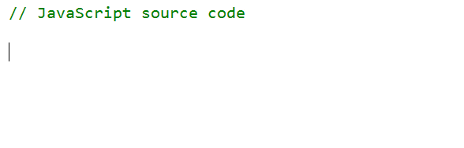
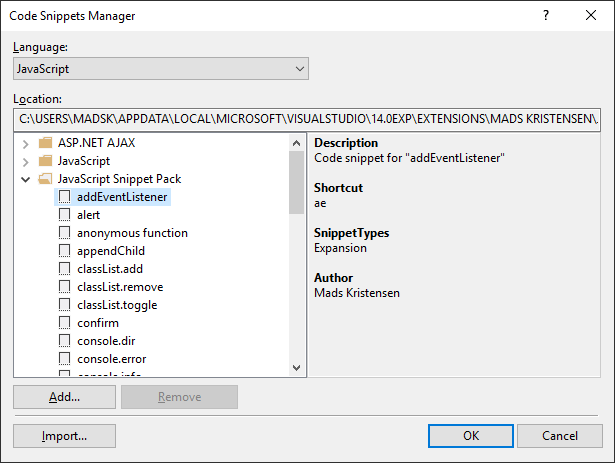

## JavaScript Snippet Pack for Visual Studio

[](https://ci.appveyor.com/project/madskristensen/javascriptsnippetpack)

Download this extension from the
[VS Gallery](https://visualstudiogallery.msdn.microsoft.com/423eb4a3-215f-4a8f-9287-1512618ffda3)
or get the
[nightly build](http://vsixgallery.com/extension/2a20580c-7be4-4440-bcd6-8dcf5aa2004e/).

-----------------------------------------

A snippet pack to make you more productive working with JavaScript.
Based on the [Atom snippets](https://atom.io/packages/javascript-snippets).



This extension ships a bunch of useful code snippets for
the JavaScript editor. Get an overview from the
**Code Snippet Manager** in Visual Studio located under
the **Tools** top level menu.



Here's the full list of all the snippets:

## Console

### [cd] console.dir

```javascript
console.dir(${1:obj});
```

### [ce] console.error

```javascript
console.error($end$);
```

### [ci] console.info

```javascript
console.info($end$);
```

### [cl] console.log

```javascript
console.log($end$);
```

### [cw] console.warn

```javascript
console.warn($end$);
```

### [de] debugger

```javascript
debugger;
```

## DOM

### [ae] addEventListener

```javascript
$document$.addEventListener('$event$', function(e) {
	$end$
});
```

### [ac] appendChild

```javascript
$document$.appendChild($elem$);
```

### [rc] removeChild

```javascript
$document$.removeChild($elem$);
```

### [cel] createElement

```javascript
$document$.createElement($elem$);
```

### [cdf] createDocumentFragment

```javascript
$document$.createDocumentFragment($elem$);
```

### [ca] classList.add

```javascript
$document$.classList.add('$class$');
```

### [ct] classList.toggle

```javascript
$document$.classList.toggle('$class$');
```

### [cr] classList.remove

```javascript
$document$.classList.remove('$class$');
```

### [gi] getElementById

```javascript
$document$.getElementById('$id$');
```

### [gc] getElementsByClassName

```javascript
$document$.getElementsByClassName('$class$');
```

### [gt] getElementsByTagName

```javascript
$document$.getElementsByTagName('$tag$');
```

### [ga] getAttribute

```javascript
$document$.getAttribute('$attr$');
```

### [sa] setAttribute

```javascript
$document$.setAttribute('$attr$', $value$);
```

### [ra] removeAttribute

```javascript
$document$.removeAttribute('$attr$');
```

### [ih] innerHTML

```javascript
$document$.innerHTML = '$elem$';
```

### [tc] textContent

```javascript
$document$.textContent = '$content$';
```

### [qs] querySelector

```javascript
$document$.querySelector('$selector$');
```

### [qsa] querySelectorAll

```javascript
$document$.querySelectorAll('$selector$');
```

## Loop

### [fe] forEach

```javascript
$myArray$.forEach(function($item$) {
	$end$
});
```

## Function

### [afn] anonymous function

```javascript
function($arguments$) {
	$end$
}
```

### [pr] prototype

```javascript
$object$.prototype.$methodName$ = function($arguments$) {
	$end$
}
```

### [call] function call

```javascript
$methodName$.call($context$, $arguments$)
```

### [apply] function apply

```javascript
$methodName$.apply($context$, [$arguments$])
```

### [ofn] function as a property of an object

```javascript
$functionName$: function($arguments$) {
	$end$
}
```

## JSON

### [jp] JSON.parse

```javascript
JSON.parse($object$);
```

### [js] JSON.stringify

```javascript
JSON.stringify($object$);
```

## Timer

### [si] setInterval

```javascript
setInterval(function() {
	$end$
}, $delay$);
```

### [st] setTimeout

```javascript
setTimeout(function() {
	$end$
}, $delay$);
```

## Misc

### [us] use strict

```javascript
'use strict';
```

### [al] alert

```javascript
alert('$message$');
```

### [co] confirm

```javascript
confirm('$message$');
```

### [pm] prompt

```javascript
prompt('$message$');
```

## Contribute
Check out the [contribution guidelines](.github/CONTRIBUTING.md)
if you want to contribute to this project.

For cloning and building this project yourself, make sure
to install the
[Extensibility Tools 2015](https://visualstudiogallery.msdn.microsoft.com/ab39a092-1343-46e2-b0f1-6a3f91155aa6)
extension for Visual Studio which enables some features
used by this project.

## License
[Apache 2.0](LICENSE)